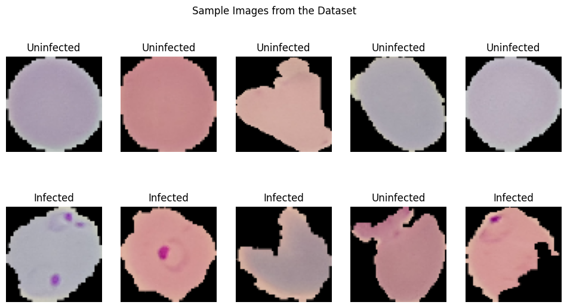

# **Malaria Cell Image Classification Using CNN**

## Overview
**Malaria** is a life-threatening disease caused by parasites that are transmitted to people through the bites of infected female Anopheles mosquitoes. It's preventable and curable, but it can be fatal if not treated promptly. The Plasmodium falciparum parasite is the most dangerous, with the highest rates of complications and mortality.

According to global health organizations, hundreds of thousands succumb to malaria annually, with a significant impact on child mortality rates. The annual death toll is certainly in the hundreds of thousands, but estimates differ between different global health organizations. The World Health Organization (WHO) estimates that **558,000** people died because of malaria in **2019**; the Institute of Health Metrics and Evaluation (IHME) puts this estimate at **643,000**.

Most victims are children. It is one of the leading causes of child mortality. Every twelfth child that died in **2017**, died because of malaria.[1] This project aims to assist in the fight against malaria by automating the detection of infected cells using deep learning.

---

[1] [Source Link](https://ourworldindata.org/malaria#)

## Project Objective
The goal of this project is to develop a **Convolutional Neural Network (CNN)** that can classify microscopic images of cells as either infected with malaria or uninfected.

## Methodology
We've employed a robust workflow to train our model:
- **Data Preprocessing**: Standardizing the cell images for model input.
- **Data Augmentation**: Enhancing the dataset to prevent overfitting and improve model robustness.
- **Model Architecture**: Designing a CNN that learns features from cell images for classification.
- **Training and Validation**: Using an iterative approach with early stopping to prevent overfitting.
- **Evaluation**: Assessing model performance with accuracy, precision, recall, F1-score, and AUC.

## Dataset
The dataset is from [Kaggle's Malaria Cell Images Dataset](https://www.kaggle.com/iarunava/cell-images-for-detecting-malaria), which is hosted on Kaggle. It contains a large number of labeled microscopic images of cells infected with malaria as well as uninfected cells.

To download the dataset, you will need a Kaggle account and the Kaggle API installed on your machine. Follow these steps:

1. Go to your Kaggle account settings and scroll down to the API section to create a new API token. This will download a `kaggle.json` file containing your API credentials.
3. Place the `kaggle.json` file inside the main notebook when the snippet below is executed:

from google.colab import files

uploaded = files.upload()  # Upload the kaggle.json file here

## Exploratory Data Analysis (EDA)

In this section, we explored the dataset to gain insights into the characteristics of the cell images used for malaria detection.

### Class Distribution

We examined the distribution of classes in the dataset to understand the balance between infected and uninfected cells. This analysis revealed that the dataset contains a relatively balanced distribution of both classes, which is essential for model training and evaluation.

### Sample Images

To visualize the dataset, we displayed a sample of images from both classes: parasitized and uninfected cells. These sample images provide a visual representation of the cells and their differences.

The sample images showcase the diversity of cell appearances and highlight the challenges of classifying them accurately.

While there were other aspects explored in the **EDA**, these findings provide a brief overview of the dataset's characteristics and challenges, which guided our approach in building the **CNN model** for malaria cell classification.

## Results
Here are some visualizations and results from our Malaria Cell Image Classification project:

### Confusion Matrix

The evaluation of the classification model yields robust metrics indicative of its reliable performance in distinguishing between '**Parasitized**' and '**Uninfected**' classes. The model achieves an accuracy of **96.03%**, reflecting its high level of correctness across predictions. **Precision**, a measure of the model's exactness, stands at **94.35%**, demonstrating that when the model predicts an instance as '**Parasitized**', it is correct more than **94%** of the time. **Recall**, or sensitivity, measures the model's ability to identify all relevant instances of '**Parasitized**' and is observed to be **97.74%**, indicating the model's strength in capturing the majority of positive cases. The **F1-score**, which harmonizes precision and recall, is at **96.02%**, underscoring the model's balanced performance in terms of both precision and recall. These metrics collectively affirm the model's efficacy and its potential utility in applications where accurate classification of parasitic infections is critical.

### Receiver Operating Characteristic (ROC) Curve and Area Under the Curve (AUC) Score

The **ROC** curve graphically represents the trade-off between the true positive rate and the false positive rate at various thresholds. An **AUC** score of **0.99** signifies that the model has an outstanding discriminative ability to differentiate between the classes. This high **AUC** score suggests that the model can reliably rank predictions with a high degree of separability between '**Parasitized**' and '**Uninfected**' outcomes.

### Training Accuracy and Loss Curves

The figures present the model's performance across the training epochs. 

1. The **Accuracy Plot** on the left indicates the trend in classification accuracy for both the training set (**blue curve**) and the validation set (**orange curve**). A higher accuracy indicates better performance of the model in correctly classifying the input data.

2. The **Loss Plot** on the right tracks the model's loss or error rate over the same epochs for both training (**blue curve**) and validation (**orange curve**). The declining trend signifies the model's improving ability to make accurate predictions by minimizing error.

## How to Use
Refer to the Jupyter notebook in this repository for detailed methodology and code implementation.

## Conclusion and Future Work
The model's strong performance underscores its potential as a diagnostic aid for rapid malaria detection. The project showcases the efficacy of CNNs in medical image analysis and their potential to support healthcare initiatives.

Future enhancements may include:
- Exploring advanced neural network architectures.
- Further hyperparameter optimization.
- Investigating transfer learning approaches for performance improvement.

## Acknowledgments
- Data provided by [Kaggle's Malaria Cell Images Dataset](https://www.kaggle.com/iarunava/cell-images-for-detecting-malaria).
- World Health Organization (WHO) for malaria statistics.

## References
1. [Our World in Data - Malaria](https://ourworldindata.org/malaria)

