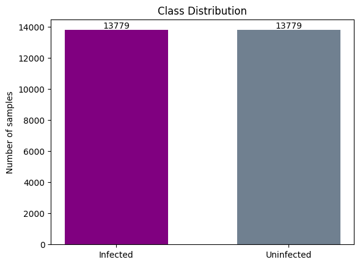

# **Malaria Cell Image Classification Using CNN**

  

*This animation illustrates the emergence of the parasites from the infected cell. For more information on the growth of human malaria parasites in their dormant form, visit [MIT News](https://news.mit.edu/2018/human-malaria-parasites-grown-first-time-dormant-form-0222).* 

## Overview
**Malaria** is a life-threatening disease caused by parasites that are transmitted to people through the bites of infected female Anopheles mosquitoes. It's preventable and curable, but it can be fatal if not treated promptly. The Plasmodium falciparum parasite is the most dangerous, with the highest rates of complications and mortality.

According to global health organizations, hundreds of thousands succumb to malaria annually, with a significant impact on child mortality rates. The annual death toll is certainly in the hundreds of thousands, but estimates differ between different global health organizations. The World Health Organization (WHO) estimates that **558,000** people died because of malaria in **2019**; the Institute of Health Metrics and Evaluation (IHME) puts this estimate at **643,000**.

Most victims are children. It is one of the leading causes of child mortality. Every twelfth child that died in **2017**, died because of malaria.[1] This project aims to assist in the fight against malaria by automating the detection of infected cells using deep learning.

---

[1] [Source Link](https://ourworldindata.org/malaria#)

## Project Objective
The goal of this project is to develop a **Convolutional Neural Network (CNN)** that can classify microscopic images of cells as either infected with malaria or uninfected.

## Methodology
We've employed a robust workflow to train our model:
- **Data Preprocessing**: Standardizing the cell images for model input.
- **Data Augmentation**: Enhancing the training data to prevent overfitting and improve model robustness.
- **Model Architecture**: Designing a CNN that learns features from cell images for classification.
- **Training and Validation**: Using an iterative approach with early stopping to prevent overfitting.
- **Evaluation**: Assessing model performance with accuracy, precision, recall, F1-score, and AUC.

## Dataset Download Instructions

The dataset used in this notebook is the "Malaria Cell Images Dataset", which is available on Kaggle. Due to its size (approximately 708 MB), it is not included in this repository. 

To use this notebook, please download the dataset by following these steps:

1. Visit the [Malaria Cell Images Dataset](https://www.kaggle.com/iarunava/cell-images-for-detecting-malaria) on Kaggle.
2. Download the dataset to your local machine.
3. Extract the dataset to a known directory.
4. Update the `dataset_path` variable in the notebook with the path to the extracted dataset on your machine.

In addition, we have provided a script named "download_dataset_from_Kaggle.py" in Script directory for user who want to download the dataset directly from Kaggle.

## Exploratory Data Analysis (EDA)

In this section, we explored the dataset to gain insights into the characteristics of the cell images used for malaria detection.

### Sample Images

To visualize the dataset, we displayed a sample of images from both classes: parasitized and uninfected cells. These sample images provide a visual representation of the cells and their differences.

  

The sample images showcase the diversity of cell appearances and highlight the challenges of classifying them accurately.

### Class Distribution

We examined the distribution of classes in the dataset to understand the balance between infected and uninfected cells. This analysis revealed that the dataset contains a well-balanced distribution of both classes, which is essential for model training and evaluation.

  

While there were other aspects explored in the **EDA**, these findings provide a brief overview of the dataset's characteristics and challenges, which guided our approach in building the **CNN model** for malaria cell classification.

## Results
Here are some visualizations and results from our Malaria Cell Image Classification project:

### Model Performance Metrics

To evaluate the effectiveness of our malaria cell image classification model, we've compiled key performance metrics. These metrics provide insights into the model's ability to accurately classify cells as either infected or uninfected. Below is a summary table showcasing these metrics:

  

| Metric         | Infected (0) | Uninfected (1) | Overall     |
|----------------|--------------|----------------|-------------|
| Precision      | 0.97         | 0.95           | -           |
| Recall         | 0.95         | 0.97           | -           |
| F1-Score       | 0.96         | 0.96           | -           |
| Accuracy       | -            | -              | 96.19%      |
| Test Loss      | -            | -              | 0.16538     |
| Samples Tested | 2797         | 2715           | 5512        |

**Key Aspects of the Table:**

- **Accuracy (95.90%)**: This is the overall correctness of the model in classifying the images. A high accuracy indicates that the model is able to correctly identify most of the infected and uninfected cells.

- **Test Loss (0.18573)**: Represents how well the model is performing against the test dataset. A lower test loss indicates that the model is making fewer mistakes in its predictions.

- **Precision, Recall, and F1-Score for Each Class**: These metrics are calculated separately for both 'Infected' and 'Uninfected' classes. 
  - _Precision_ reflects the proportion of true positive identifications among all positive identifications made by the model.
  - _Recall_ (or sensitivity) indicates the proportion of actual positives correctly identified.
  - _F1-Score_ is the harmonic mean of precision and recall, providing a balance between these two metrics.

- **Macro and Weighted Averages**: These provide an overall picture of the model's performance across both classes. The macro average calculates metrics independently for each class and then takes the average, treating all classes equally. The weighted average takes class imbalance into account.

The above metrics are essential for understanding the model's strengths and areas for improvement, especially in a medical imaging context where accuracy and reliability are crucial.

### Confusion Matrix

  

- **True Positives (TP) - 2615:** The model correctly identified **2615** cells as **'Infected'**.
- **True Negatives (TN) - 2671:** The model correctly identified **2671** cells as **'Uninfected'**.
- **False Positives (FP) - 182:** The model incorrectly identified **182** cells as **'Infected'** when they were actually **'Uninfected'**.
- **False Negatives (FN) - 44:** The model incorrectly identified **44** cells as **'Uninfected'** when they were actually **'Infected'**.

### Receiver Operating Characteristic (ROC) Curve and Area Under the Curve (AUC) Score

  

The **ROC** curve graphically represents the trade-off between the true positive rate and the false positive rate at various thresholds. An **AUC** score of **0.99** signifies that the model has an outstanding discriminative ability to differentiate between the classes. This high **AUC** score suggests that the model can reliably rank predictions with a high degree of separability between '**Parasitized**' and '**Uninfected**' outcomes.

### Training Accuracy and Loss Curves

  

The figures present the model's performance across the training epochs. 

1. The **Accuracy Plot** on the left indicates the trend in classification accuracy for both the training set (**blue curve**) and the validation set (**orange curve**). A higher accuracy indicates better performance of the model in correctly classifying the input data.

2. The **Loss Plot** on the right tracks the model's loss or error rate over the same epochs for both training (**blue curve**) and validation (**orange curve**). The declining trend signifies the model's improving ability to make accurate predictions by minimizing error.

## Tuned Model Results and Comparison

### Overview of the Tuned Model
Following the initial success of our CNN model, we employed hyperparameter tuning to further refine the model's performance. The tuning process involved systematically searching for the optimal combination of hyperparameters using a **Keras Tuner**. This approach aimed to enhance the model's ability to classify cell images with greater accuracy and reliability.

### Results of the Tuned Model
The hyperparameter tuning resulted in a model with improved metrics, as highlighted below:

- **Accuracy**: Increased marginally to **96.08%** from **96.03%**.
- **Test Loss**: Reduced significantly to **0.10908** from **0.19740**, indicating better generalization on the validation data.
- **Precision for 'Parasitized'**: Slightly decreased to **0.97** from **0.98**, suggesting a minor trade-off for improved recall.
- **Recall for 'Parasitized'**: Improved to **0.95** from **0.94**, indicating the model's enhanced ability to identify positive cases.
- **F1-Score for 'Parasitized'**: Remained consistently high at **0.96** for both models, demonstrating a balance between precision and recall.

### Confusion Matrix for the Tuned Model
The confusion matrix for the tuned model is as follows:

  

This matrix shows the model's performance in predicting the actual classes of the test set, where the number of correctly predicted instances for both **'Parasitized'** and 'Uninfected' cells showcases the model's robustness.

### Comparison with the Untuned Model
When compared to the untuned model, the tuned model shows a slight improvement in overall accuracy and a more substantial decrease in test loss. The confusion matrix reveals a better recall rate, which is critical in medical diagnostics where missing a positive case (false negative) can have serious consequences.

While the precision has slightly decreased, the trade-off resulted in a model that is more sensitive to detecting **'Parasitized'** cells, which is a valuable characteristic for early intervention in malaria treatment.

### F1-Score Comparison
The **F1-Score**, which combines precision and recall into a single metric, remained constant at **0.96** for both models. This indicates that despite the changes in individual precision and recall rates, the overall harmonic balance of these metrics is maintained.

### Conclusion of the Tuned Model Evaluation
The tuned model demonstrates a promising direction for improving malaria detection. The slight adjustments in performance metrics illustrate the nuances of model optimization and highlight the potential for even minor enhancements to have a significant impact on the model's application in real-world scenarios.

## Setting Up the Environment
To run the notebooks in this repository, you can create a Conda environment with all the necessary dependencies using the provided **malaria_detection_env.yml** file. Follow these steps:

1. Ensure you have [Anaconda](https://www.anaconda.com/products/individual) or [Miniconda](https://docs.conda.io/en/latest/miniconda.html) installed.
2. Clone or download this repository to your local machine.
3. Navigate to the repository directory in your terminal.
4. Run `conda env create -f malaria_detection_env.yml` to create the environment.
5. Once the environment is created, activate it with `conda activate malaria_detection_env.yml`.

## Conclusion and Future Work
The model's strong performance underscores its potential as a diagnostic aid for rapid malaria detection. The project showcases the efficacy of CNNs in medical image analysis and their potential to support healthcare initiatives.

Future enhancements may include:
- Exploring advanced neural network architectures.
- Further hyperparameter optimization.
- Investigating transfer learning approaches for performance improvement.

## Acknowledgments
- A special thanks to **Dr. Ehsan (Sam) Gharib-Nezhad** and **Dr. Amirhossein Kardoost** for their insightful feedback and suggestions that significantly enhanced the quality of this project. Their expertise and thoughtful reviews were tremendously helpful. You can find more about their works on [EhsanGharibNezhad](https://github.com/EhsanGharibNezhad) and [Amir_kd](https://github.com/Amirhk-dev).
- Data provided by [Kaggle's Malaria Cell Images Dataset](https://www.kaggle.com/iarunava/cell-images-for-detecting-malaria).
- World Health Organization (WHO) for malaria statistics.

## References
1. [Our World in Data - Malaria](https://ourworldindata.org/malaria)

